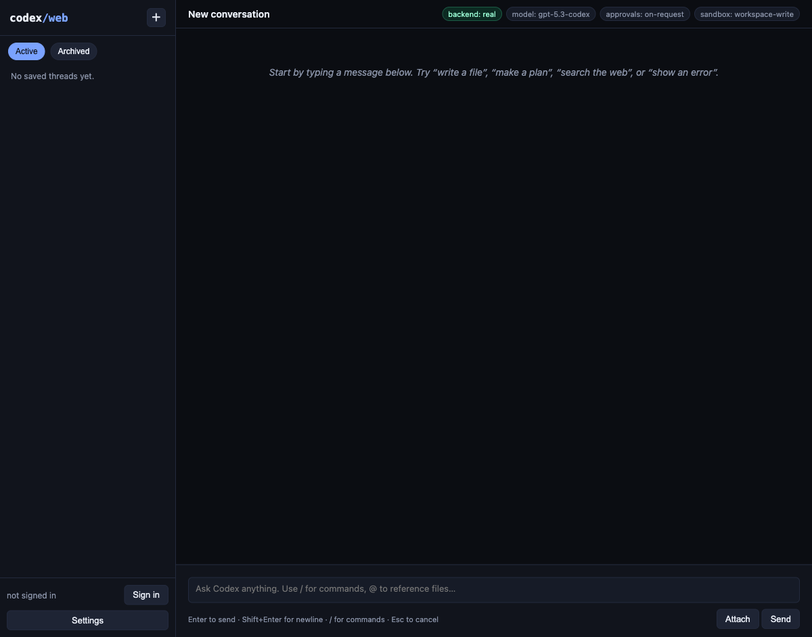

# Codex Web

Production-grade browser UI for the real Rust `codex app-server`, built for
live local use and publish-ready deployment on Replit.

<p align="center">
  
</p>

## What This Repo Ships

This repository includes the upstream Codex Rust workspace, but the productized
surface here is the web app under [`web/`](./web/). It runs against a real
`codex` or `codex-app-server` binary only.

Key capabilities:

- real `app-server` v2 transport over HTTP + WebSocket, with no mock mode
- ChatGPT sign-in on localhost plus device-code auth for public deployments
- API key sign-in for deterministic automation and live smoke testing
- per-session backend processes and per-session workdirs
- resume, fork, archive, unarchive, rename, and rollback thread workflows
- image attachments, inline workdir file previews, and streaming output cards
- settings, MCP management, rate-limit/status pills, and sidebar thread filters
- Replit workflow and Deployments support using a standalone backend binary

## Quick Start

### Option 1: Use an installed Codex binary

```bash
cd web
npm install
CODEX_BIN="$HOME/.local/bin/codex" npm start
```

### Option 2: Build the standalone backend first

```bash
./web/scripts/build-codex-bin.sh
cd web
CODEX_BIN="$HOME/codex-bin/codex-app-server" npm start
```

The web app serves on `http://127.0.0.1:5000` by default.

## Authentication

The web app supports two sign-in paths plus API keys:

- `localhost` / `127.0.0.1`: browser callback auth via
  `account/login/start { type: "chatgpt" }`
- public or non-local deployments: gateway-managed device-code auth
- API keys: `POST /api/login`

The gateway also owns refresh-token handling for public device-code sessions, so
long-running browser sessions can respond to
`account/chatgptAuthTokens/refresh` without forcing a re-login.

## Live Testing

This project is real-backend-only. The smoke suites run against an actual
backend binary, not a mock.

```bash
cd web
CODEX_BIN="$HOME/.local/bin/codex" npm run test:e2e
```

Auth-gated smoke:

```bash
cd web
CODEX_BIN="$HOME/.local/bin/codex" PLAYWRIGHT_AUTH=1 npm run test:e2e:auth
```

Authenticated workflow smoke with a real API key:

```bash
cd web
CODEX_BIN="$HOME/.local/bin/codex" \
PLAYWRIGHT_AUTH=1 \
PLAYWRIGHT_API_KEY="$OPENAI_API_KEY" \
npm run test:e2e:auth
```

## Replit Deployment

Replit should build the standalone backend once, then run the gateway against
that binary:

```bash
./web/scripts/build-codex-bin.sh
cd web
CODEX_BIN="$HOME/codex-bin/codex-app-server" npm start
```

The checked-in [`.replit`](./.replit) file already points both the workspace
run command and Deployments build/run flow at the standalone backend path.

## Project Docs

- [Web app guide](./web/README.md)
- [Release checklist](./web/RELEASE_CHECKLIST.md)
- [Replit deployment notes](./replit.md)
- [Contributing](./docs/contributing.md)

## Repository Layout

- [`web/`](./web/) — browser client, Node gateway, Playwright coverage, and
  Replit helpers
- [`codex-rs/`](./codex-rs/) — Rust `app-server`, protocol, and shared backend
  crates
- [`docs/`](./docs/) — broader repository and contributor docs

## License

This repository is licensed under the [Apache-2.0 License](./LICENSE).
