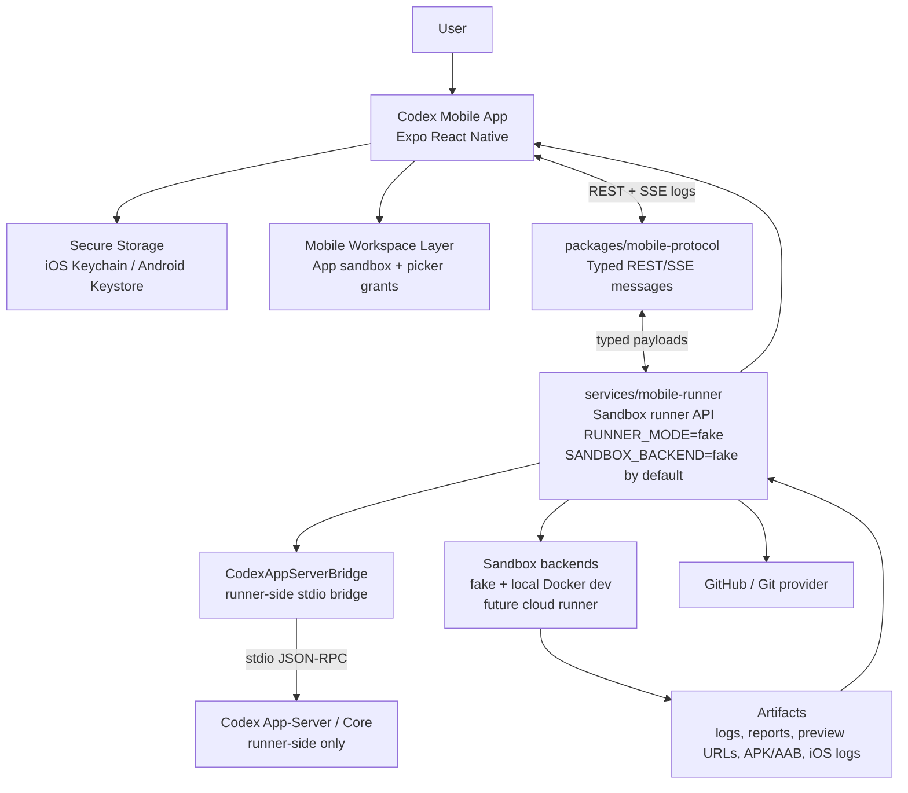

# Codex Mobile App Roadmap

Status: MVP foundation, fake end-to-end runner flow, gated Codex app-server bridge, app-server diff-to-patch review, and a first runner-side sandbox build/test backend are implemented. Fake modes remain the default.

This roadmap designs a publishable iOS and Android Codex mobile app that feels like a mobile Codex CLI/TUI/Desktop client without pretending that a phone is an unrestricted developer workstation. The mobile app is a controller, editor, reviewer, and preview surface. Build and test execution belongs in a sandboxed remote runner.

## Research Summary

Repository seams inspected:

- `codex-rs/app-server-protocol` exposes the strongest client boundary. Its v2 API already has `thread/start`, `turn/start`, turn/item streaming notifications, filesystem RPCs, diff notifications, auth/account methods, and `command/exec`.
- `codex-rs/app-server` is the reference host for rich clients. It owns app-server transport, login orchestration, thread lifecycle, command execution, filesystem APIs, and remote-control/device-key pieces.
- `codex-rs/login` owns Codex-managed ChatGPT OAuth, device-code login, API-key login, token refresh, and storage through file/keyring/ephemeral backends.
- `codex-rs/keyring-store` and `codex-rs/secrets` are useful desktop/server-side credential patterns, but mobile must use iOS Keychain and Android Keystore-backed secure storage through the app runtime.
- `codex-rs/core`, `codex-rs/exec`, `codex-rs/sandboxing`, `codex-rs/state`, and `codex-rs/thread-store` should remain runner-side for now. They assume desktop/server filesystem and process capabilities that do not map cleanly to iOS or Android app sandboxes.
- `sdk/typescript` is useful as a conceptual SDK layer, but today it shells out to `codex exec`, so it is not directly suitable for a phone app.

Public constraints checked:

- OpenAI Codex CLI docs say Codex CLI can authenticate with a ChatGPT account or API key on first run: <https://developers.openai.com/codex/cli>.
- OpenAI Codex cloud docs describe Codex running tasks in a cloud environment connected to GitHub repos: <https://developers.openai.com/codex/cloud>.
- OpenAI code-generation docs describe Codex across IDE, CLI, web/mobile sites, and CI/CD SDK use: <https://developers.openai.com/api/docs/guides/code-generation>.
- Apple App Review Guideline 2.5.2 requires apps to stay self-contained and not download, install, or execute code that changes app functionality; it also requires apps that select files to include Files app/iCloud documents where applicable: <https://developer.apple.com/app-store/review/guidelines/>.
- Android app-specific storage and scoped storage docs require app-specific storage by default and user-mediated access for shared documents: <https://developer.android.com/training/data-storage/app-specific>.
- Android Storage Access Framework docs support user-selected documents/directories and persistable URI permissions with Android 11 restrictions: <https://developer.android.com/training/data-storage/shared/documents-files>.
- Expo SDK 55 currently targets React Native 0.83 and React 19.2, which makes Expo with a dev-client escape hatch the most realistic first scaffold: <https://docs.expo.dev/versions/latest/>.

## Product Shape

The app should present mobile-native Codex workflows:

- Project list
- GitHub repo clone/import flow
- App-sandbox workspaces
- User-selected files/folders through Files app or Android SAF
- Code editor and file tree
- Agent chat with streaming output
- Diff review with accept/reject shell
- Commit/push shell
- WebView preview shell where safe
- Build/test status backed by a remote runner
- Settings/Auth screen with production ChatGPT auth gated until officially supported

The app should not present:

- Unrestricted phone filesystem editing
- A local terminal for arbitrary downloaded code
- Local iOS compilation on device
- Hidden browser-cookie auth
- ChatGPT scraping
- Password collection

## Architecture



## Local vs Remote Split

Runs on device:

- Project metadata and recent-workspace list
- App-contained file browsing/editing
- User-picked file import/export
- Diff rendering and accept/reject decisions
- Agent chat UI and event streaming
- WebView preview of trusted URLs or static generated previews
- Secure token/key storage abstraction

Runs in remote sandbox:

- `npm`, `cargo`, `python`, `gradle`, and Xcode-related commands
- Allowlisted build/test/package-manager commands
- Arbitrary generated shell commands only after future explicit approval and sandbox policy support
- Git clone/fetch/push when credentials are delegated to the runner
- Dependency installation
- Test execution
- Artifact production
- Codex core/app-server execution until a supported mobile-native Codex runtime exists

## Store Compliance Guardrails

- The mobile app edits app-contained workspaces by default. It must not claim unrestricted access to arbitrary phone files.
- iOS file access uses the app sandbox first and Files app/document-picker grants where applicable. Persistent external-folder access needs a security-scoped bookmark implementation before it can be represented as durable.
- Android file access uses app-specific storage first and Storage Access Framework grants for user-selected files or folders. Broad all-files access is out of scope for this roadmap.
- Heavy builds, tests, dependency installs, shell commands, Gradle, and Xcode-related workflows run in remote sandbox runners, not on the phone.
- Production ChatGPT/Codex account auth stays gated until OpenAI confirms a supported public mobile OAuth or device-code flow for this client class.
- The mobile app does not connect directly to `codex app-server`. The runner owns that local bridge and only exposes the mobile protocol over its own API.
- App-server diffs are treated as patch proposals. They require explicit user review and approval before any workspace file is changed.
- App-server approval requests fail closed until a first-class mobile approval UI exists.
- Build/test commands run in runner-side sandbox backends. The local Docker adapter is for development only and does not make production cloud sandboxing complete.

## MVP Work Items

Phase 0: Foundation in this change

- Add `docs/mobile/` roadmap, ADR, and auth investigation.
- Add `packages/mobile-protocol` with typed session, job, log, patch, artifact, auth, file, and diff messages.
- Add `services/mobile-runner` stub with REST endpoints and fake SSE log streaming.
- Add `apps/mobile` Expo scaffold with navigation and placeholder screens.
- Add secure storage, auth state machine, file workspace, and diff-review shell.
- Keep production ChatGPT/Codex account auth disabled by default behind a feature flag.
- Keep dev API-key mode separate and visibly marked.

Phase 1: Real runner integration

- Wire the mobile scaffold to the fake runner contract for an end-to-end sample-project session. Done.
- Add `RUNNER_MODE=fake | codex-app-server`, with fake as the default. Done.
- Add runner capabilities reporting and job metadata showing the active mode. Done.
- Add a stdio-only `CodexAppServerBridge` prototype behind `RUNNER_MODE=codex-app-server`. Done for bridge startup, initialize, `thread/start`, `turn/start`, notification mapping, and structured unavailable errors.
- Host the runner in a sandbox-capable environment.
- Bridge runner sessions to `codex app-server` v2 over local stdio/unix socket or authenticated websocket. Stdio prototype is implemented; unix socket and authenticated local websocket remain future work.
- Mirror app-server turn/item notifications into mobile-friendly events. Initial log/status mapping is implemented.
- Map app-server `turn/diff/updated` unified diffs into mobile `PatchProposal` review models. Done for modified, added, deleted, empty, and unsupported text diff cases.
- Add project snapshot upload and incremental file sync.
- Add interactive mobile approval UI for app-server command/write/network/permission requests. Not done; current bridge fails closed and never auto-approves.
- Add first runner-side sandbox build/test backend. Done for `SANDBOX_BACKEND=fake` and opt-in local-development `SANDBOX_BACKEND=local-docker`.
- Add production cloud sandbox build/test backend. Not done; local Docker is not production infrastructure.

Phase 2: GitHub and project lifecycle

- Add GitHub OAuth or GitHub App flow.
- Clone repos in the runner and sync editable snapshots to the phone.
- Add commit/push flow with explicit user review.
- Add artifact browser and web preview URLs.

Phase 3: Production auth

- Confirm whether OpenAI supports ChatGPT/Codex OAuth or device-code auth for this mobile client class.
- If supported, use ASWebAuthenticationSession on iOS and Chrome Custom Tabs/AppAuth on Android.
- Use an app-specific public client configuration and no embedded client secrets.
- Store tokens only in Keychain/Keystore-backed storage.
- If not supported, ship with production account auth disabled and keep only dev API-key testing.

Phase 4: Native polish

- Add iOS security-scoped bookmark native module if Expo APIs are not enough.
- Add Android SAF directory native module if Expo APIs are not enough.
- Add richer editor, search, syntax highlighting, WebView preview controls, and offline project metadata.

Final Phase: Store Release Readiness

iOS / App Store:

- Apple Developer account required.
- App Store Connect app record required.
- Bundle identifier planning using `IOS_BUNDLE_IDENTIFIER`.
- App name, subtitle, SKU, and category selection.
- Privacy Policy URL using `PRIVACY_POLICY_URL`.
- App Privacy answers and data collection disclosures.
- Export compliance and encryption answers.
- TestFlight internal testing before any wider release.
- TestFlight external testing if needed.
- App Review submission checklist.
- iPhone screenshots.
- App icon and launch assets.
- Version/build number policy using `expo.version` and iOS `buildNumber`.
- Review notes explaining:
  - this is a mobile coding-agent IDE.
  - file access is limited to the app workspace and user-selected files.
  - builds/tests run remotely in a sandboxed runner.
  - the app does not execute arbitrary downloaded code locally on iPhone.
  - ChatGPT/Codex sign-in is either officially supported or disabled/gated.

Android / Google Play:

- Google Play Developer account required.
- Play Console app record required.
- Permanent Android package name using `GOOGLE_PLAY_PACKAGE_NAME`.
- Android App Bundle / AAB production build.
- Play App Signing.
- Internal testing track before production release.
- Closed/open testing if needed.
- Data Safety form.
- Privacy Policy URL using `PRIVACY_POLICY_URL`.
- Content rating.
- Target audience/declarations.
- Store listing assets.
- Screenshots.
- VersionCode/versionName policy using Android `versionCode` and `expo.version`.
- Review notes explaining:
  - scoped storage / SAF usage.
  - no broad all-files access by default.
  - remote sandbox runner for heavy builds/tests.
  - clear user approval before file changes.

## Initial Internal Seam

The mobile app should not call `codex-core` directly. The first publishable seam is:

1. Mobile app talks to `services/mobile-runner` through `packages/mobile-protocol`.
2. Runner talks to Codex app-server/core in a server environment.
3. Codex app-server stays responsible for threads, turns, streaming, auth status, diffs, command execution, and filesystem operations inside a runner workspace.
4. Mobile keeps only user-approved local copies and UI state.

This keeps mobile-specific code isolated and avoids adding mobile assumptions to high-risk core crates.

## Run Instructions

After dependencies are installed:

```bash
corepack enable --install-directory "$HOME/.local/bin"
export PATH="$HOME/.local/bin:$PATH"
pnpm install
pnpm --filter @codex/mobile-protocol build
pnpm --filter @codex/mobile-protocol test
pnpm --filter @codex/mobile-runner test
pnpm --filter @codex/mobile-runner dev
pnpm --filter @codex/mobile start
```

The runner streams deterministic fake logs by default and can stream real local Docker sandbox logs when `SANDBOX_BACKEND=local-docker` is enabled. The mobile app renders working navigation and sample project flows over local app-workspace data.

Milestone 4 also supports a gated real Codex app-server patch-review path. When `RUNNER_MODE=codex-app-server` emits `turn/diff/updated`, the runner parses the aggregated unified diff into a mobile `PatchProposal`. The app displays it in `DiffReviewScreen`, blocks unsupported changes, and applies supported text patches only after the user taps apply. Approval requests from app-server currently fail closed instead of auto-approving.

To try the gated Codex app-server bridge locally, start the runner with:

```bash
CODEX_APP_SERVER_BIN=/absolute/path/to/codex \
RUNNER_MODE=codex-app-server \
CODEX_APP_SERVER_TRANSPORT=stdio \
pnpm --filter @codex/mobile-runner dev
```

If the Codex binary cannot start or the bridge cannot initialize, the runner returns a structured error instead of pretending the fake runner is real Codex. Normal mobile testing should continue to use the default `RUNNER_MODE=fake` until remote sandbox infrastructure and supported production ChatGPT/Codex mobile auth are confirmed.

To try the local Docker sandbox backend for development:

```bash
SANDBOX_BACKEND=local-docker \
SANDBOX_DOCKER_IMAGE=node:22-bookworm-slim \
SANDBOX_DOCKER_NETWORK=none \
pnpm --filter @codex/mobile-runner dev
```

The mobile `BuildRunnerScreen` can start safe build/test actions such as install dependencies, run tests, and build project. The runner maps those actions to allowlisted command kinds and streams real Docker logs when the local Docker backend is enabled. It does not expose Docker to the phone, does not run privileged containers, does not mount host secrets, and does not accept raw shell commands unless the explicit dev-only `ENABLE_UNSAFE_CUSTOM_COMMANDS=1` flag is set.

EAS builds Codex Mobile itself for TestFlight and Google Play. The sandbox backend runs users' project build/test commands in runner environments. They are separate systems.

Milestone 6 adds GitHub-style workspace lifecycle foundations and a cloud runner control-plane skeleton.

Git provider modes:

```bash
GIT_PROVIDER=fake
GIT_PROVIDER=local-git
GIT_PROVIDER=github-app
```

`fake` remains the default and supports import, feature-branch creation, status, commit, push, and PR-plan metadata without network or credentials. `github-app` is server-side only and remains gated until the GitHub App install/token flow is implemented. The mobile app never receives GitHub App private keys, installation tokens, service-account credentials, or personal access tokens.

Cloud runner provider modes:

```bash
CLOUD_RUNNER_PROVIDER=fake
CLOUD_RUNNER_PROVIDER=none
CLOUD_RUNNER_PROVIDER=aws-fargate
CLOUD_RUNNER_PROVIDER=gcp-cloud-run-jobs
CLOUD_RUNNER_PROVIDER=fly-machines
CLOUD_RUNNER_PROVIDER=kubernetes
```

Only `fake` is implemented. The control plane now has provider interfaces, in-memory job records, quota policy, audit log store, artifact store, cleanup policy, and dev auth scaffolding. Production cloud sandbox execution still requires a real provider adapter, durable persistence, object storage, production API auth, monitoring, cleanup workers, and abuse controls.

## Next Milestone

The next real build step is implementing one production-grade server-side integration lane: either the GitHub App install/clone/commit/push flow or a real cloud sandbox provider adapter with durable job/artifact persistence. Both should stay server-side, keep secrets out of mobile, and preserve branch-first user approval.
