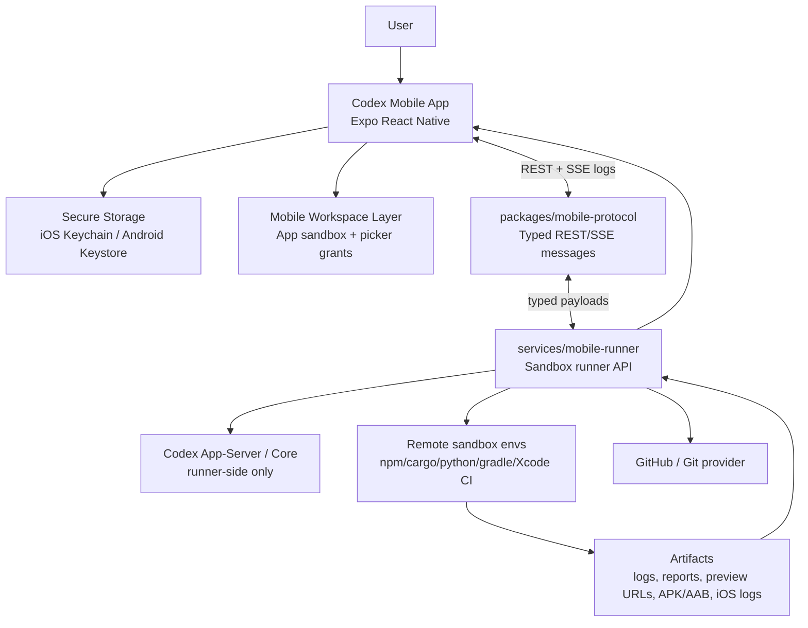

# Codex Mobile App Roadmap

Status: MVP foundation started.

This roadmap designs a publishable iOS and Android Codex mobile app that feels like a mobile Codex CLI/TUI/Desktop client without pretending that a phone is an unrestricted developer workstation. The mobile app is a controller, editor, reviewer, and preview surface. Build and test execution belongs in a sandboxed remote runner.

## Research Summary

Repository seams inspected:

- `codex-rs/app-server-protocol` exposes the strongest client boundary. Its v2 API already has `thread/start`, `turn/start`, turn/item streaming notifications, filesystem RPCs, diff notifications, auth/account methods, and `command/exec`.
- `codex-rs/app-server` is the reference host for rich clients. It owns app-server transport, login orchestration, thread lifecycle, command execution, filesystem APIs, and remote-control/device-key pieces.
- `codex-rs/login` owns Codex-managed ChatGPT OAuth, device-code login, API-key login, token refresh, and storage through file/keyring/ephemeral backends.
- `codex-rs/keyring-store` and `codex-rs/secrets` are useful desktop/server-side credential patterns, but mobile must use iOS Keychain and Android Keystore-backed secure storage through the app runtime.
- `codex-rs/core`, `codex-rs/exec`, `codex-rs/sandboxing`, `codex-rs/state`, and `codex-rs/thread-store` should remain runner-side for now. They assume desktop/server filesystem and process capabilities that do not map cleanly to iOS or Android app sandboxes.
- `sdk/typescript` is useful as a conceptual SDK layer, but today it shells out to `codex exec`, so it is not directly suitable for a phone app.

Public constraints checked:

- OpenAI Codex CLI docs say Codex CLI can authenticate with a ChatGPT account or API key on first run: <https://developers.openai.com/codex/cli>.
- OpenAI Codex cloud docs describe Codex running tasks in a cloud environment connected to GitHub repos: <https://developers.openai.com/codex/cloud>.
- OpenAI code-generation docs describe Codex across IDE, CLI, web/mobile sites, and CI/CD SDK use: <https://developers.openai.com/api/docs/guides/code-generation>.
- Apple App Review Guideline 2.5.2 requires apps to stay self-contained and not download, install, or execute code that changes app functionality; it also requires apps that select files to include Files app/iCloud documents where applicable: <https://developer.apple.com/app-store/review/guidelines/>.
- Android app-specific storage and scoped storage docs require app-specific storage by default and user-mediated access for shared documents: <https://developer.android.com/training/data-storage/app-specific>.
- Android Storage Access Framework docs support user-selected documents/directories and persistable URI permissions with Android 11 restrictions: <https://developer.android.com/training/data-storage/shared/documents-files>.
- Expo SDK 55 currently targets React Native 0.83 and React 19.2, which makes Expo with a dev-client escape hatch the most realistic first scaffold: <https://docs.expo.dev/versions/latest/>.

## Product Shape

The app should present mobile-native Codex workflows:

- Project list
- GitHub repo clone/import flow
- App-sandbox workspaces
- User-selected files/folders through Files app or Android SAF
- Code editor and file tree
- Agent chat with streaming output
- Diff review with accept/reject shell
- Commit/push shell
- WebView preview shell where safe
- Build/test status backed by a remote runner
- Settings/Auth screen with production ChatGPT auth gated until officially supported

The app should not present:

- Unrestricted phone filesystem editing
- A local terminal for arbitrary downloaded code
- Local iOS compilation on device
- Hidden browser-cookie auth
- ChatGPT scraping
- Password collection

## Architecture



## Local vs Remote Split

Runs on device:

- Project metadata and recent-workspace list
- App-contained file browsing/editing
- User-picked file import/export
- Diff rendering and accept/reject decisions
- Agent chat UI and event streaming
- WebView preview of trusted URLs or static generated previews
- Secure token/key storage abstraction

Runs in remote sandbox:

- `npm`, `cargo`, `python`, `gradle`, and Xcode-related commands
- Arbitrary generated shell commands
- Git clone/fetch/push when credentials are delegated to the runner
- Dependency installation
- Test execution
- Artifact production
- Codex core/app-server execution until a supported mobile-native Codex runtime exists

## Store Compliance Guardrails

- The mobile app edits app-contained workspaces by default. It must not claim unrestricted access to arbitrary phone files.
- iOS file access uses the app sandbox first and Files app/document-picker grants where applicable. Persistent external-folder access needs a security-scoped bookmark implementation before it can be represented as durable.
- Android file access uses app-specific storage first and Storage Access Framework grants for user-selected files or folders. Broad all-files access is out of scope for this roadmap.
- Heavy builds, tests, dependency installs, shell commands, Gradle, and Xcode-related workflows run in remote sandbox runners, not on the phone.
- Production ChatGPT/Codex account auth stays gated until OpenAI confirms a supported public mobile OAuth or device-code flow for this client class.

## MVP Work Items

Phase 0: Foundation in this change

- Add `docs/mobile/` roadmap, ADR, and auth investigation.
- Add `packages/mobile-protocol` with typed session, job, log, patch, artifact, auth, file, and diff messages.
- Add `services/mobile-runner` stub with REST endpoints and fake SSE log streaming.
- Add `apps/mobile` Expo scaffold with navigation and placeholder screens.
- Add secure storage, auth state machine, file workspace, and diff-review shell.
- Keep production ChatGPT/Codex account auth disabled by default behind a feature flag.
- Keep dev API-key mode separate and visibly marked.

Phase 1: Real runner integration

- Wire the mobile scaffold to the fake runner contract for an end-to-end sample-project session.
- Host the runner in a sandbox-capable environment.
- Bridge runner sessions to `codex app-server` v2 over local stdio/unix socket or authenticated websocket.
- Mirror app-server turn/item notifications into mobile-friendly events.
- Map app-server diff/file-change notifications into mobile diff review models.
- Add project snapshot upload and incremental file sync.

Phase 2: GitHub and project lifecycle

- Add GitHub OAuth or GitHub App flow.
- Clone repos in the runner and sync editable snapshots to the phone.
- Add commit/push flow with explicit user review.
- Add artifact browser and web preview URLs.

Phase 3: Production auth

- Confirm whether OpenAI supports ChatGPT/Codex OAuth or device-code auth for this mobile client class.
- If supported, use ASWebAuthenticationSession on iOS and Chrome Custom Tabs/AppAuth on Android.
- Use an app-specific public client configuration and no embedded client secrets.
- Store tokens only in Keychain/Keystore-backed storage.
- If not supported, ship with production account auth disabled and keep only dev API-key testing.

Phase 4: Native polish

- Add iOS security-scoped bookmark native module if Expo APIs are not enough.
- Add Android SAF directory native module if Expo APIs are not enough.
- Add richer editor, search, syntax highlighting, WebView preview controls, and offline project metadata.

Final Phase: Store Release Readiness

iOS / App Store:

- Apple Developer account required.
- App Store Connect app record required.
- Bundle identifier planning using `IOS_BUNDLE_IDENTIFIER`.
- App name, subtitle, SKU, and category selection.
- Privacy Policy URL using `PRIVACY_POLICY_URL`.
- App Privacy answers and data collection disclosures.
- Export compliance and encryption answers.
- TestFlight internal testing before any wider release.
- TestFlight external testing if needed.
- App Review submission checklist.
- iPhone screenshots.
- App icon and launch assets.
- Version/build number policy using `expo.version` and iOS `buildNumber`.
- Review notes explaining:
  - this is a mobile coding-agent IDE.
  - file access is limited to the app workspace and user-selected files.
  - builds/tests run remotely in a sandboxed runner.
  - the app does not execute arbitrary downloaded code locally on iPhone.
  - ChatGPT/Codex sign-in is either officially supported or disabled/gated.

Android / Google Play:

- Google Play Developer account required.
- Play Console app record required.
- Permanent Android package name using `GOOGLE_PLAY_PACKAGE_NAME`.
- Android App Bundle / AAB production build.
- Play App Signing.
- Internal testing track before production release.
- Closed/open testing if needed.
- Data Safety form.
- Privacy Policy URL using `PRIVACY_POLICY_URL`.
- Content rating.
- Target audience/declarations.
- Store listing assets.
- Screenshots.
- VersionCode/versionName policy using Android `versionCode` and `expo.version`.
- Review notes explaining:
  - scoped storage / SAF usage.
  - no broad all-files access by default.
  - remote sandbox runner for heavy builds/tests.
  - clear user approval before file changes.

## Initial Internal Seam

The mobile app should not call `codex-core` directly. The first publishable seam is:

1. Mobile app talks to `services/mobile-runner` through `packages/mobile-protocol`.
2. Runner talks to Codex app-server/core in a server environment.
3. Codex app-server stays responsible for threads, turns, streaming, auth status, diffs, command execution, and filesystem operations inside a runner workspace.
4. Mobile keeps only user-approved local copies and UI state.

This keeps mobile-specific code isolated and avoids adding mobile assumptions to high-risk core crates.

## Run Instructions

After dependencies are installed:

```bash
corepack enable --install-directory "$HOME/.local/bin"
export PATH="$HOME/.local/bin:$PATH"
pnpm install
pnpm --filter @codex/mobile-protocol build
pnpm --filter @codex/mobile-protocol test
pnpm --filter @codex/mobile-runner test
pnpm --filter @codex/mobile-runner dev
pnpm --filter @codex/mobile start
```

The runner currently streams fake logs and returns fake artifact metadata. The mobile app currently renders working navigation and placeholder flows over local sample data.
